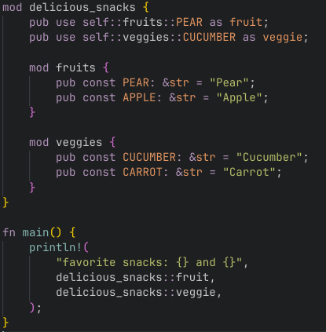

# Tomorrow Night Rusty 

Dark VSCode theme inspired by Rust docs (https://doc.rust-lang.org/book/). Looks similar to Microsoft's Tomorrow Night with some modifications.



# Installation

1. Open the **Extensions** sidebar in VS Code. `View → Extensions`
1. Search for `Tomorrow Night Rusty`, choose "Tomorrow Night Rusty"
1. Click **Install** to install it
1. Navigate to File > Preferences > Color Theme > **Tomorrow Night Rusty**

Add this line to your settings.json for better syntax highlighting: <Ctrl-Shift-P> > Preferences: Open User Settings (JSON)

```json
"editor.semanticHighlighting.enabled": true,
```