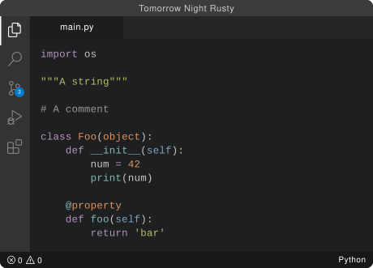

# Tomorrow Night Rusty 

Dark VSCode theme inspired by code snippets from Rust docs (https://doc.rust-lang.org/book/). Supports most popular programming languages (C/C++, Python, JavaScript, Rust, Go, Java, C# and more).

# Preview


# Installation

## Install From VSCode
1. Open the **Extensions** sidebar in VS Code. `View → Extensions`
2. Search for `Tomorrow Night Rusty`, choose "Tomorrow Night Rusty"
3. Click **Install** to install it
4. Navigate to File > Preferences > Themes > Color Theme > **Tomorrow Night Rusty**

Add this line to your settings.json for better syntax highlighting: <kbd>Ctrl</kbd> + <kbd>Shift</kbd> + <kbd>P</kbd> > Preferences: Open User Settings (JSON)

```json
"editor.semanticHighlighting.enabled": true,
```

## Manual Installation
Alternatively, you can get .vsix from the latest release here: https://github.com/n3tw4lk3r/Tomorrow-Night-Rusty-for-VSCode/releases

Then:
1. Open the **Extensions** sidebar in VS Code. `View → Extensions`
2. Press `...` → `Install from VSIX...` and select your downloaded .vsix file

## Feedback
Feel free to open an issue on GitHub, or rate this extension in VSCode Marketplace!
